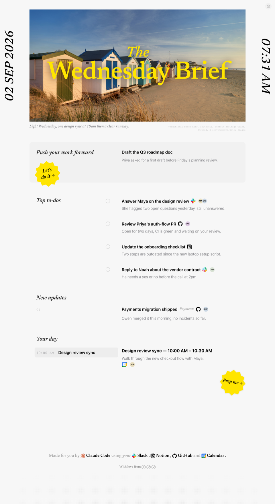

# Morning Brief



Your day on one page, every weekday morning: to-dos from Slack and Notion, your PRs, your calendar, one thing to push forward, and a painting. Generated locally by Claude Code, with your own Claude subscription. No API keys, no server, no account beyond Claude and the connectors you already use.

## You need

- A Mac, with the Claude desktop app and Claude Code (any plan that includes Claude Code).
- Node 20+ and the GitHub CLI (`gh`), logged in.
- Any browser. Nothing Dia-specific.

## Install in one prompt

Open Claude Code in the Claude desktop app and paste:

```
Set up Morning Brief for me: clone https://github.com/thomasdqr/morning-brief, then read its SETUP.md and follow it step by step.
```

Claude checks your machine, asks 3 short questions, installs a small local server, creates the daily task, and tells you what to click. About 5 minutes, most of it Claude working.

## Manual install

1. `git clone https://github.com/thomasdqr/morning-brief ~/Documents/GitHub/morning-brief`
2. `~/Documents/GitHub/morning-brief/scripts/install.sh`
3. Copy `config.example.json` to `data/config.json` and fill it in (name, email, browser, the repo folder for the yellow buttons).
4. In Claude Code Desktop, create a scheduled task named `morning-brief`, weekdays at 07:30, with the content of `TASK_PROMPT.md` as its prompt.
5. Sidebar → Scheduled → **Run now** on `morning-brief`, click **Allow** for each connector once.

## How it works

- `PROMPT.md` is the editorial spec: what to read, how to write it, the JSON shape. A Claude Code Desktop scheduled task reads it every weekday morning and writes `data/briefs/YYYY-MM-DD.json`.
- `server.mjs` is a small Node server (no dependencies) that serves the page at `http://localhost:4747`, remembers checked to-dos, and picks the image of the day.
- `public/index.html` is the page itself. Gear icon, top right: language and image source.
- The yellow buttons open a new Claude Code session in the desktop app with the task pre-filled, so you review before anything runs.

## Good to know

- Claude Code Desktop must be open on weekday mornings for the task to fire. If it's closed, the brief is generated the next time you open it.
- A checked to-do is never proposed again.
- Image sources: The Met, Cleveland Museum of Art, NASA picture of the day, Bing photo of the day, Unsplash (needs a free access key from unsplash.com/developers).
- Everything runs and stays on your machine. `data/` (your briefs, your settings) is never committed.
- No telemetry, no external server beyond the public museum/photo APIs the brief pulls from.
